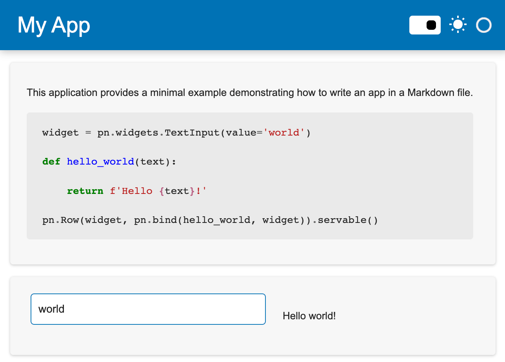

# Write apps in Markdown

This guide addresses how to write Panel apps inside Markdown files.

---

Panel applications can be written as Python scripts (`.py`), notebooks (`.ipynb`) and also Markdown files (`.md`). This is particularly useful when writing applications that serve both as documentation and as an application, e.g. when writing a demo.

To begin simply create a Markdown file with the `.md` file extension, e.g. `app.md`. Once created give your app a title:

```markdown
# My App
```

Before adding any actual content add a code block with any imports your application needs. The code block should have one of two type declarations, either `python` or `{pyodide}`. The latter is useful if you also want to use [the Sphinx Pyodide integration](../wasm/sphinx.md). In this case we will simply declare a `python` code block that imports Panel and calls the extension with a specific template:

````markdown
```python
import panel as pn

pn.extension(template='fast')
```
````

Once we have initialized the extension any subsequent Markdown will be rendered as part of the application, e.g. we can put some description in our application. If you also want to render some Python code without having Panel interpret it as code, use `.py` as the language declaration:

````markdown
This application provides a minimal example demonstrating how to write an app in a Markdown file.

```.py
widget = pn.widgets.TextInput(value='world')

def hello_world(text):
    return f'Hello {text}!'

pn.Row(widget, pn.bind(hello_world, widget)).servable()
```
````

Now we can add some actual Panel contents, again inside a `python` code block:

````markdown
```python
widget = pn.widgets.TextInput(value='world')

def hello_world(text):
    return f'Hello {text}!'

pn.Row(widget, pn.bind(hello_world, widget)).servable()
```
````

To put it all together, here is what our app looks like:

:::{card} app.md
````markdown
# My App

```python
import panel as pn

pn.extension(template='fast')
```

This application provides a minimal example demonstrating how to write an app in a Markdown file.

```.py
widget = pn.widgets.TextInput(value='world')

def hello_world(text):
    return f'Hello {text}!'

pn.Row(widget, pn.bind(hello_world, widget)).servable()
```

```python
widget = pn.widgets.TextInput(value='world')

def hello_world(text):
    return f'Hello {text}!'

pn.Row(widget, pn.bind(hello_world, widget)).servable()
```
````

Then, from the command line, launch a server with:

```bash
panel serve app.md --show --autoreload
```


