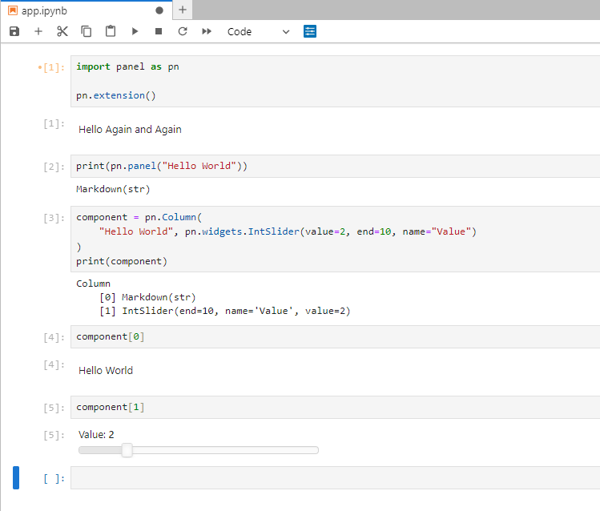
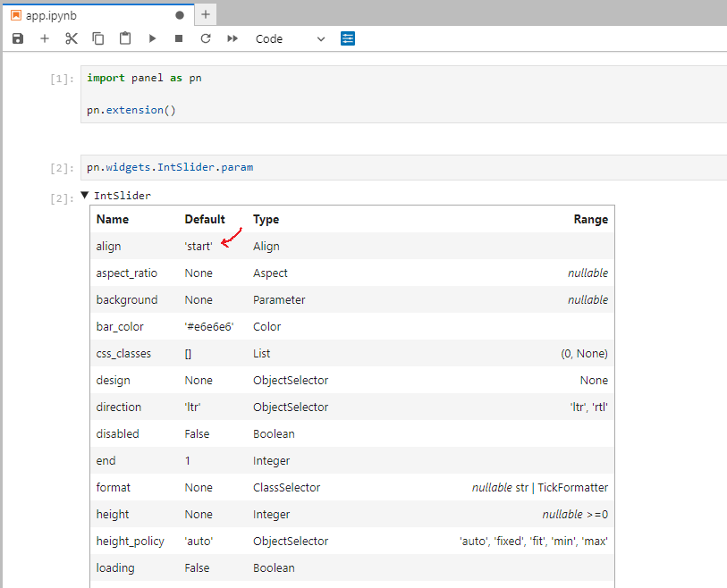

# Develop in a Notebook

Welcome to the "Develop in a Notebook" section! Here, we'll explore the fundamentals of efficiently developing Panel apps directly within a notebook environment.

Let's dive in!

## Preview Your App

Let's preview our app.

Start by creating a new notebook named `app.ipynb`.

### Preview Example

Here's a simple notebook containing a Panel app:


Copy and paste the following code cells into your notebook:

```python
import panel as pn

pn.extension()
```

```python
pn.panel("Hello World").servable()
```

```python
pn.panel("Hello Again")
```

Run the cells and save the notebook as `app.ipynb`.

:::{note}

The Jupyter Panel Preview feature described below works exclusively within the JupyterLab interface. It does not support the Classic Jupyter Notebook interface.

To use this preview feature, please ensure you are working within a JupyterLab environment.

:::

You can now preview the app by clicking the *Jupyter Panel Preview* icon. This icon can be found above the notebook.


Upon clicking the *Jupyter Panel Preview* icon, you'll see your app launch in a separate window. If "Hello Again" isn't displayed, it's because it hasn't been marked as `.servable()`. Update the cell containing `pn.panel("Hello Again")` to include `.servable()` and save the notebook. Click the *Reload Preview* button in the *Jupyter Panel Preview*.

It should look like


:::{tip}
You can enhance your workflow by enabling *auto-reload* with the *Render on Save* option, which automatically reloads your app when the notebook is saved.
:::

The video shows how a larger app could be developed.

<video muted controls loop poster="../../_static/images/jupyter_panel_preview_in_action.png" style="max-height: 400px; max-width: 100%;">
    <source src="https://assets.holoviz.org/panel/tutorials/jupyter_panel_preview_in_action.mp4">
</video>

## Serve Your App with Autoreload

Alternatively, you can serve your notebook externally with autoreload using the following command:

```bash
panel serve app.ipynb --autoreload
```

This method provides a faster alternative to the *Jupyter Panel Preview*. Check out the video for inspiration.

<video muted controls loop poster="../../_static/images/develop_notebook_panel_serve_after.png" style="max-height: 400px; max-width: 100%;">
    <source src="https://assets.holoviz.org/panel/tutorials/develop_notebook_panel_serve.mp4" type="video/mp4">
    Your browser does not support the video tag.
</video>

:::{dropdown} Code

```python
import panel as pn
import numpy as np

from matplotlib.figure import Figure

ACCENT = "goldenrod"
LOGO = "https://assets.holoviz.org/panel/tutorials/matplotlib-logo.png"

pn.extension(sizing_mode="stretch_width")
```

```python
data = np.random.normal(1, 1, size=100)
fig = Figure(figsize=(8,4))
ax = fig.subplots()
ax.hist(data, bins=20, color=ACCENT)

component = pn.pane.Matplotlib(fig, format='svg', sizing_mode='scale_both')

pn.template.FastListTemplate(
    title="My App", sidebar=[LOGO], main=[component], accent=ACCENT
).servable();
```

:::

## Inspect a Component using `SHIFT+Tab`

Start from an empty notebook named `app.ipynb`.

Copy-paste the code below into the first cell

```python
import panel as pn

pn.extension()
```

Run the cell.

Write `pn.widgets.IntSlider` in a cell and press `SHIFT+Tab`.

It should look like


Use the mouse to scroll down until we find the *Example* code snippet and *Reference* link.


Click the *Reference* link <a href="https://panel.holoviz.org/reference/widgets/IntSlider.html" target="_blank">https://panel.holoviz.org/reference/widgets/IntSlider.html</a>.

It should now look like

[](https://panel.holoviz.org/reference/widgets/IntSlider.html)

:::{tip}
It is a great idea to use the *Example* code snippets and *Reference* links to speed up our workflow.
:::

## Inspect a Component using `print`

Start from an empty notebook named `app.ipynb`.

Copy-paste the code below into the notebook.

```python
import panel as pn

pn.extension()
```

```python
print(pn.panel("Hello World"))
```

```python
component = pn.Column(
    "Hello World", pn.widgets.IntSlider(value=2, end=10, name="Value")
)
print(component)
```

Run the cells if they have not already been run.

It should look like


:::{note}
By printing *layout* components like `Column` we can understand how they are composed. This enables us to *access* the subcomponents of the layout.
:::

Add the two code cells below

```python
component[0]
```

```python
component[1]
```

Run the cells if they have not already been run.

It should look like



## Inspect a Component's Parameters using `.param`

Start from an empty notebook named `app.ipynb`.

Copy-paste the two code cells below into the notebook.

```python
import panel as pn

pn.extension()
```

```python
pn.widgets.IntSlider.param
```

Run the cells if they have not already been run.

It should look like



:::{note}
- The `.param` table shows us the **default** parameter values of the `IntSlider` **class**. For example, the *default* value of `align` is `'start'`.
- The `.param` table shows us additional information like the `Type` and `Range` of the Parameter.
:::

Add the new cell

```python
pn.widgets.IntSlider(align="end").param
```

Run the code cell.

It should look like


:::{note}
- In the picture above we see the **actual** parameter values of the `IntSlider` **instance**. For example, the *actual* value of `align` is `'end'`.
:::

## Recap

In this section, we covered:

- Previewing a notebook app with the *Jupyter Panel Preview*.
- Serving a notebook app with autoreload.
- Inspecting components using `SHIFT+Tab`, `print`, and `.param`.

Now you're equipped with the tools to efficiently develop Panel apps directly within a notebook environment!

## Resources

For more detailed instructions and explanations, check out the resources below:

- [Develop in Other Notebook Environments](../../how_to/notebook/notebook.md)
- [Display Output in Notebooks](../../how_to/notebook/notebook.md)
- [Preview Apps in JupyterLab](../../how_to/notebook/jupyterlabpreview.md)
- [Publish a Notebook as a Dashboard using the Layout Builder](../../how_to/notebook/layout_builder.md)
- [Serve an App from a Notebook File](serve.md)
- [Use PyCharm Notebook Environment](https://panel.holoviz.org/how_to/editor/pycharm_configure.html#notebook-environment)
- [Use VS Code Notebook Environment](https://panel.holoviz.org/how_to/editor/vscode_configure.html#notebook-and-interactive-environment)

Happy developing! 🚀
