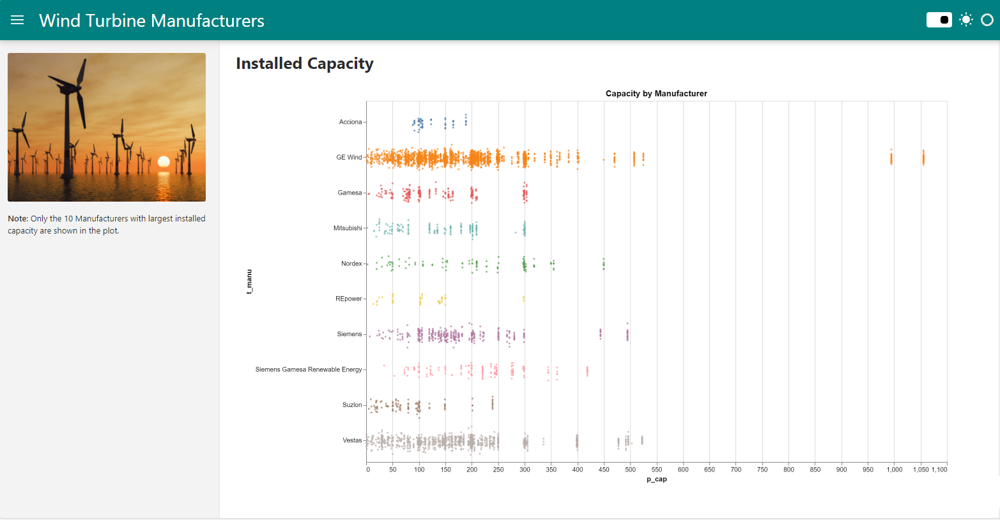

# Utilize Templates

Welcome to the world of Panel templates! In this tutorial, we'll explore how to harness pre-made templates to effortlessly structure your app with a header, sidebar, and main area.

Templates offer a streamlined approach to app layout and design, providing:

- Ready-made templates accessible in the `pn.template` namespace.
- A variety of customizable options to suit your specific needs.

## Crafting a Hello World App

Let's start by creating a basic app using the [`FastListTemplate`](../../reference/templates/FastListTemplate.ipynb). Copy the following code into a file named `app.py`:

```python
import panel as pn

pn.extension()

pn.template.FastListTemplate(
    title="Hello World",
    sidebar=["# Hello Sidebar", "This is text for the *sidebar*"],
    main=["# Hello Main", "This is text for the *main* area"],
).servable()
```

Serve the app with:

```bash
panel serve app.py --autoreload
```

It should resemble the following:


:::{note}
In the code snippet:

- `pn.template.FastListTemplate` defines the template to use.
- `title` sets an optional title for the top header.
- `sidebar` and `main` designate content areas for the sidebar and main section, respectively.

For additional configuration options, refer to the [`FastListTemplate` reference guide](../../reference/templates/FastListTemplate.ipynb).
:::

:::{tip}
Panel offers a rich assortment of built-in templates, including a versatile [`Slides`](../../reference/templates/Slides.ipynb) template.
:::

Take a moment to explore the [Templates Section](https://panel.holoviz.org/reference/index.html#templates) in the [Component Gallery](../../reference/index.md), then return here.

## Integrating Templates in a Notebook

While templates shine in serving apps, they're currently not displayable within notebooks. Copy the following two code cells into a notebook:

```python
import panel as pn

pn.extension()
```

```python
pn.template.FastListTemplate(
    title="Hello World",
    sidebar=["# Hello Sidebar", "This is text for the *sidebar*"],
    main=["# Hello Main", "This is text for the *main* area"],
).servable()
```

Append a `;` after `.servable()` to prevent template display in the notebook. Preview the app; it should resemble:


:::{warning}
Notebook display of templates is not currently supported. Show your support for this feature by upvoting [Issue #2677](https://github.com/holoviz/panel/issues/2677).
:::

## Tailoring the Template

Let's customize the template further. Copy the code below into `app.py`:

```python
import panel as pn
import pandas as pd
import altair as alt

pn.extension("vega")

ACCENT = "teal"

image = pn.pane.JPG("https://assets.holoviz.org/panel/tutorials/wind_turbines_sunset.png")

if pn.config.theme=="dark":
    alt.themes.enable("dark")
else:
    alt.themes.enable("default")

@pn.cache # Add caching to only download data once
def get_data():
    return pd.read_csv("https://assets.holoviz.org/panel/tutorials/turbines.csv.gz")

df = get_data()

top_manufacturers = (
    df.groupby("t_manu").p_cap.sum().sort_values().iloc[-10:].index.to_list()
)
df = df[df.t_manu.isin(top_manufacturers)]
fig = (
    alt.Chart(
        df.sample(5000),
        title="Capacity by Manufacturer",
    )
    .mark_circle(size=8)
    .encode(
        y="t_manu:N",
        x="p_cap:Q",
        yOffset="jitter:Q",
        color=alt.Color("t_manu:N").legend(None),
        tooltip=["t_manu", "p_cap"],
    )
    .transform_calculate(jitter="sqrt(-2*log(random()))*cos(2*PI*random())")
    .properties(
        height="container",
        width="container",
    )
)
plot = pn.pane.Vega(fig, sizing_mode="stretch_both", max_height=800, margin=20)

pn.template.FastListTemplate(
    title="Wind Turbine Manufacturers",
    sidebar=[image, "**Note**: Only the 10 Manufacturers with the largest installed capacity are shown in the plot."],
    main=["# Installed Capacity", plot],
    accent=ACCENT,
    main_layout=None,
).servable()
```

Serve the app with:

```bash
panel serve app.py --autoreload
```

It should appear as shown below. Try toggling the theme button in the upper right corner.



Upon toggling, the app should switch to dark mode:


:::{note}
In the code:

- `pn.config.theme` determines the selected theme ("default" or "dark").
- `alt.themes.enable("dark")` applies the "dark" theme to the plot. Panel doesn't do this automatically.
- `accent` sets the primary or accent color for the template, allowing quick branding of the app.
- `main_layout` specifies a layout to wrap each object in the main list. Choose from `"card"` (default) or `None`.

Note that `accent` and `main_layout` are exclusive to Fast templates like [FastListTemplate](../../reference/templates/FastListTemplate.ipynb) and [FastGridTemplate](../../reference/templates/FastGridTemplate.ipynb).
:::

## Recap

In this tutorial, we've explored the power of pre-made templates for structuring your app with ease:

- Templates are available in the `pn.template` namespace.
- Find a variety of templates in the [Templates Section](https://panel.holoviz.org/reference/index.html#templates) of the [Component Gallery](../../reference/index.md).
- Templates offer high customizability.

## References

### How-to Guides

- [Arrange Components in a Template](../../how_to/templates/template_arrange.md)
- [Build a Custom Template](../../how_to/templates/template_custom.md)
- [Customize Template Theme](../../how_to/templates/template_theme.md)
- [Set a Template](../../how_to/templates/template_set.md)
- [Style Altair Plots](../../how_to/styling/altair.md)
- [Style Echarts Plots](../../how_to/styling/echarts.md)
- [Style Matplotlib Plots](../../how_to/styling/matplotlib.md)
- [Style Plotly Plots](../../how_to/styling/plotly.md)
- [Style Vega/ Altair Plots](../../how_to/styling/vega.md)
- [Toggle Modal](../../how_to/templates/template_modal.md)

### Explanations

- [Templates Overview](../../explanation/styling/templates_overview.md)

### Component Gallery

- Explore the [Templates Section](https://panel.holoviz.org/reference/index.html#templates) in the [Component Gallery](../../reference/index.md) for more options.
